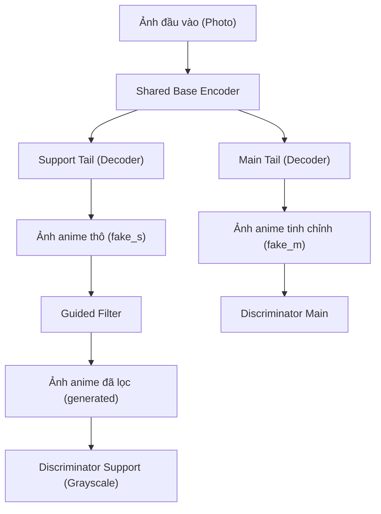
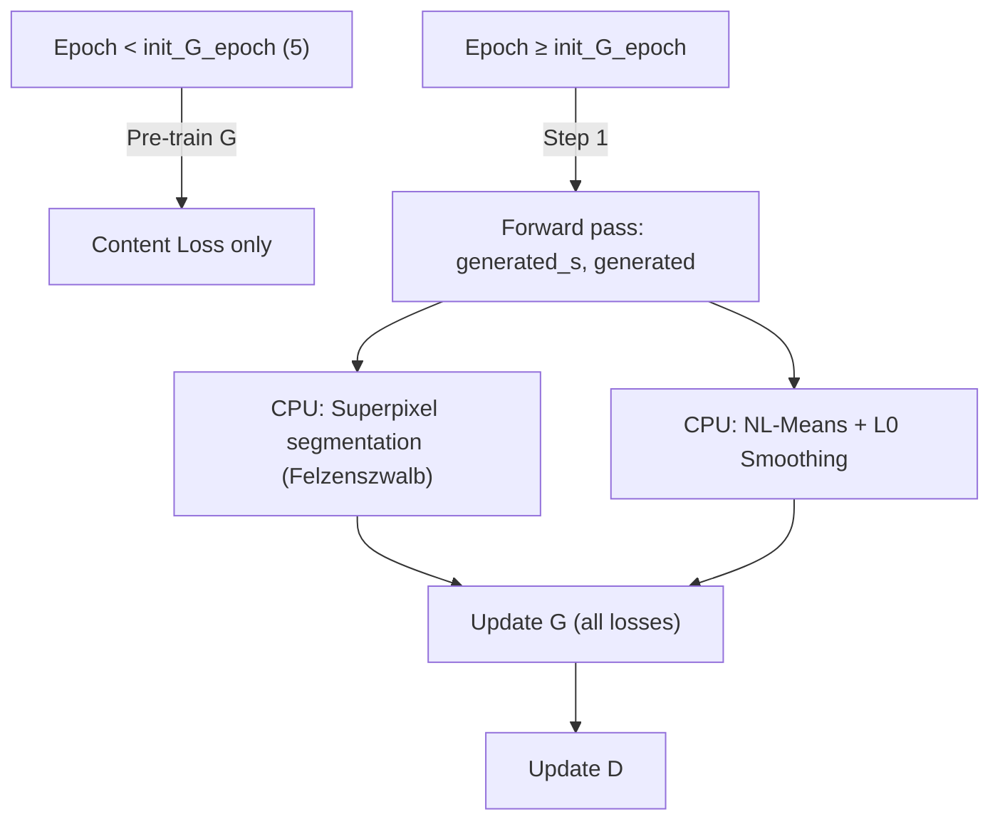
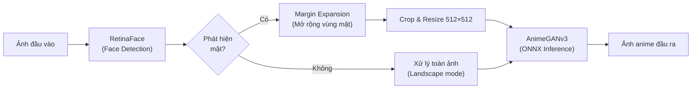
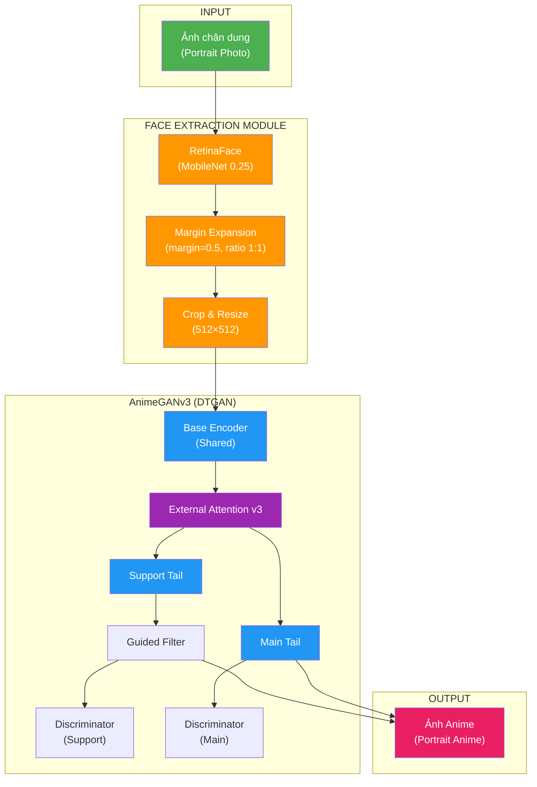

# ĐỀ CƯƠNG LUẬN VĂN THẠC SĨ

## MẠNG ĐỐI NGHỊCH TẠO SINH TRONG CHUYỂN ĐỔI ẢNH CHÂN DUNG SANG PHONG CÁCH ANIME

> **Tên tiếng Anh:** Generative Adversarial Networks for Portrait-to-Anime Style Transfer
>
> **Dựa trên:** AnimeGANv3 (DTGAN) — *"A Novel Double-Tail Generative Adversarial Network for Fast Photo Animation"*
> Gang LIU, Xin CHEN, Zhixiang GAO — IEICE Trans. Inf. & Syst., Vol. E107-D, No. 1, pp. 72–82, 2024.

---

## MỤC LỤC ĐỀ CƯƠNG

| Chương | Nội dung | Ước tính trang |
|--------|----------|:--------------:|
| 1 | Tổng quan | 8–10 |
| 2 | Cơ sở lý thuyết | 25–30 |
| 3 | Kiến trúc mô hình AnimeGANv3 | 25–30 |
| 4 | Module trích xuất khuôn mặt (Face Extraction) | 15–18 |
| 5 | Thực nghiệm và đánh giá | 15–20 |
| 6 | Kết luận và hướng phát triển | 5–7 |
| | **Tổng cộng** | **~93–115** |

---

## CHƯƠNG 1: TỔNG QUAN

### 1.1. Lý do chọn đề tài
- Nhu cầu chuyển đổi ảnh chân dung sang phong cách anime trong giải trí, mạng xã hội, game
- Hạn chế của các phương pháp truyền thống (style transfer dựa trên tối ưu hóa, CycleGAN tốc độ chậm, chất lượng không ổn định)
- AnimeGANv3 đề xuất kiến trúc Double-Tail GAN đạt cả tốc độ nhanh lẫn chất lượng cao
- **Đóng góp của luận văn:** Tích hợp module **trích xuất khuôn mặt (Face Extraction)** sử dụng RetinaFace để tạo pipeline hoàn chỉnh: Ảnh đầu vào → Phát hiện khuôn mặt → Cắt & mở rộng vùng mặt → Chuyển đổi anime → Kết quả

### 1.2. Mục tiêu nghiên cứu
1. Nghiên cứu và trình bày lý thuyết GAN, các biến thể ứng dụng trong chuyển đổi phong cách ảnh
2. Phân tích chi tiết kiến trúc AnimeGANv3 (DTGAN): Generator hai nhánh, kỹ thuật chuẩn hóa LADE, hệ thống hàm mất mát
3. Xây dựng module trích xuất khuôn mặt dựa trên RetinaFace với kỹ thuật mở rộng vùng mặt (margin expansion)
4. Huấn luyện, đánh giá mô hình trên bộ dữ liệu phong cách Hayao/Shinkai
5. Xây dựng ứng dụng demo (GUI/Web) sử dụng ONNX Runtime

### 1.3. Đối tượng và phạm vi nghiên cứu
- **Đối tượng:** Ảnh chân dung người thực (portrait photos)
- **Phạm vi:**
  - Chuyển đổi phong cách: Hayao Miyazaki, Makoto Shinkai
  - Hỗ trợ cả ảnh đơn và video
  - Mô hình triển khai suy luận bằng ONNX

### 1.4. Phương pháp nghiên cứu
- Nghiên cứu lý thuyết: Tổng hợp tài liệu, bài báo liên quan
- Thực nghiệm: Huấn luyện mô hình trên GPU (TensorFlow 1.x)
- Đánh giá: FID, LPIPS, khảo sát người dùng (user study), tốc độ suy luận (FPS)

### 1.5. Cấu trúc luận văn
- Tóm tắt cấu trúc 6 chương

---

## CHƯƠNG 2: CƠ SỞ LÝ THUYẾT

### 2.1. Mạng nơ-ron tích chập (CNN)
- 2.1.1. Lớp tích chập (Convolution Layer)
- 2.1.2. Các hàm kích hoạt: ReLU, Leaky ReLU, Tanh, Sigmoid
- 2.1.3. Các kỹ thuật chuẩn hóa: Batch Normalization, Instance Normalization, Layer Normalization, Group Normalization
  > Quan trọng vì LADE (sẽ trình bày ở Chương 3) là cải tiến trên nền Instance Normalization
- 2.1.4. Spectral Normalization (SN)
  > Được dùng trong Discriminator — tham chiếu [spectral_norm()](file:///Users/trognhann/Desktop/gan_thesis/AnimeGANv3/tools/ops.py#L91-L116)

### 2.2. Mạng đối nghịch tạo sinh (GAN)
- 2.2.1. Kiến trúc GAN gốc (Goodfellow et al., 2014)
  - Generator G và Discriminator D
  - Hàm mục tiêu min-max
  - Quá trình huấn luyện đối nghịch
- 2.2.2. Các biến thể GAN quan trọng
  - **DCGAN:** Sử dụng CNN cho G và D
  - **WGAN / WGAN-GP:** Wasserstein distance, gradient penalty
  - **LSGAN:** Least-squares loss — *AnimeGANv3 sử dụng biến thể này*
  - **CycleGAN:** Chuyển đổi phong cách không ghép cặp (unpaired)
  - **Pix2Pix:** Chuyển đổi phong cách có giám sát (paired)
- 2.2.3. Ứng dụng GAN trong chuyển đổi phong cách ảnh (Neural Style Transfer)
  - Gatys et al. (2016) — Style transfer dựa tối ưu hóa
  - Johnson et al. (2016) — Feed-forward style transfer
  - CartoonGAN (2018)
  - AnimeGAN (2020), AnimeGANv2 (2021)

### 2.3. Mạng trích đặc trưng VGG19
- 2.3.1. Kiến trúc VGG19
- 2.3.2. Perceptual Loss (Feature Matching Loss)
  > Tham chiếu [VGG_LOSS()](file:///Users/trognhann/Desktop/gan_thesis/AnimeGANv3/tools/ops.py#L357-L362) — sử dụng layer conv4_4 (512 channels)
- 2.3.3. Gram Matrix và Style Loss
  > Tham chiếu [gram()](file:///Users/trognhann/Desktop/gan_thesis/AnimeGANv3/tools/ops.py#L342-L347) và [style_loss_decentralization_3()](file:///Users/trognhann/Desktop/gan_thesis/AnimeGANv3/tools/ops.py#L377-L396)

### 2.4. Phát hiện khuôn mặt (Face Detection)
- 2.4.1. Tổng quan các phương pháp: Viola-Jones, MTCNN, SSD, YOLO
- 2.4.2. **RetinaFace** (Deng et al., 2019)
  - Kiến trúc: Feature Pyramid Network + Multi-task Learning
  - Backbone: MobileNet 0.25 (lightweight) — được sử dụng trong GUI
  > Tham chiếu [retinaface_/config.py](file:///Users/trognhann/Desktop/gan_thesis/AnimeGANv3_gui.exe/retinaface_/config.py) — `cfg_mnet`
  - Anchor boxes: multi-scale `[[16,32], [64,128], [256,512]]`
  - Prior Box generation
  - Non-Maximum Suppression (NMS)
- 2.4.3. Suy luận với ONNX Runtime
  > Tham chiếu [face_det.py L20-22](file:///Users/trognhann/Desktop/gan_thesis/AnimeGANv3_gui.exe/face_det.py#L20-L22)

### 2.5. Lọc ảnh và tiền xử lý
- 2.5.1. Guided Filter
  > Tham chiếu [GuidedFilter.py](file:///Users/trognhann/Desktop/gan_thesis/AnimeGANv3/tools/GuidedFilter.py) — làm mịn có bảo toàn cạnh
- 2.5.2. L0 Smoothing
  > Tham chiếu [L0_smoothing.py](file:///Users/trognhann/Desktop/gan_thesis/AnimeGANv3/tools/L0_smoothing.py) — loại bỏ chi tiết giữ biên mạnh
- 2.5.3. Superpixel Segmentation (Felzenszwalb)
  > Tham chiếu [get_seg()](file:///Users/trognhann/Desktop/gan_thesis/AnimeGANv3/AnimeGANv3_hayao.py#L285-L295)
- 2.5.4. Non-Local Means Denoising
  > Tham chiếu [get_NLMean_l0()](file:///Users/trognhann/Desktop/gan_thesis/AnimeGANv3/AnimeGANv3_hayao.py#L306-L314)
- 2.5.5. Edge Smoothing
  > Tham chiếu [edge_smooth.py](file:///Users/trognhann/Desktop/gan_thesis/AnimeGANv3/tools/edge_smooth.py)

---

## CHƯƠNG 3: KIẾN TRÚC MÔ HÌNH AnimeGANv3 (DTGAN)

> [!IMPORTANT]
> Đây là chương trọng tâm kỹ thuật của luận văn. Cần trình bày chi tiết và đầy đủ.

### 3.1. Tổng quan kiến trúc DTGAN



- **Ý tưởng cốt lõi:** Generator có 1 encoder chung (Base) và 2 decoder song song (Double-Tail)
- **Support Tail:** Tạo đường nét anime thô, huấn luyện với grayscale discriminator
- **Main Tail:** Tinh chỉnh chi tiết, huấn luyện với ảnh đã qua NL-Means + L0 Smoothing

### 3.2. Generator (G_net)

> Tham chiếu: [generator.py](file:///Users/trognhann/Desktop/gan_thesis/AnimeGANv3/net/generator.py)

#### 3.2.1. Base Encoder (Shared)
```
Input (256×256×3)
  → conv_LADE_Lrelu(32, k=7)           → x0 (256×256×32)
  → conv_LADE_Lrelu(32, stride=2)      → (128×128×32)
  → conv_LADE_Lrelu(64)                → x1 (128×128×64)
  → conv_LADE_Lrelu(64, stride=2)      → (64×64×64)
  → conv_LADE_Lrelu(128)               → x2 (64×64×128)
  → conv_LADE_Lrelu(128, stride=2)     → (32×32×128)
  → conv_LADE_Lrelu(128)               → x3 (32×32×128)
```

**Điểm chú ý:**
- Sử dụng `conv_LADE_Lrelu` thay vì Conv-BN-ReLU truyền thống
- Encoder chia sẻ trọng số giữa 2 nhánh decoder
- 3 lần downsampling (stride=2) → feature map 32×32

#### 3.2.2. Support Tail (Decoder nhánh hỗ trợ)
```
x3 → External_attention_v3 → s_x3
  → Upsample 2× + conv_LADE_Lrelu(128) + skip(x2) → s_x4 (64×64)
  → Upsample 2× + conv_LADE_Lrelu(64) + skip(x1)  → s_x5 (128×128)
  → Upsample 2× + conv_LADE_Lrelu(32) + skip(x0)  → s_x6 (256×256)
  → Conv2D(3, k=7, stride=1) → tanh → fake_s
```

#### 3.2.3. Main Tail (Decoder nhánh chính)
- Cấu trúc tương tự Support Tail nhưng **trọng số riêng biệt**
- Sử dụng External Attention riêng

**Cả hai nhánh đều có:**
- **Skip connections** (U-Net style): `s_x4 + x2`, `s_x5 + x1`, `s_x6 + x0`
- **External Attention v3** tại bottleneck (32×32)
- **Bilinear upsampling** thay vì transposed convolution

### 3.3. Kỹ thuật chuẩn hóa LADE (Linearly Adaptive Denormalization)

> Tham chiếu: [LADE()](file:///Users/trognhann/Desktop/gan_thesis/AnimeGANv3/tools/ops.py#L263-L271) và [LADE_D()](file:///Users/trognhann/Desktop/gan_thesis/AnimeGANv3/tools/ops.py#L252-L260)

#### 3.3.1. Công thức LADE
Cho feature map đầu vào `x` với C kênh:

1. **Tính tham số thích ứng:** `tx = Conv1×1(x)` → tính `μ_t, σ_t` (mean, std của tx)
2. **Instance Normalization:** `x_in = (x - μ_x) / sqrt(σ_x² + ε)`
3. **Adaptive Denormalization:** `output = x_in × sqrt(σ_t² + ε) + μ_t`

```python
# LADE implementation
tx = Conv2D(x, ch, 1, 1)                              # Projection
t_mean, t_sigma = tf.nn.moments(tx, axes=[1,2])       # Target statistics
in_mean, in_sigma = tf.nn.moments(x, axes=[1,2])      # Input statistics
x_in = (x - in_mean) / sqrt(in_sigma + eps)           # IN normalize
output = x_in * sqrt(t_sigma + eps) + t_mean           # Adaptive denorm
```

#### 3.3.2. So sánh LADE với các kỹ thuật khác
| Kỹ thuật | Tham số thích ứng | Nhược điểm |
|----------|-------------------|-----------|
| Batch Norm | Từ batch statistics | Phụ thuộc batch size |
| Instance Norm | Cố định γ, β | Mất thông tin toàn cục |
| AdaIN | Từ style image | Cần style riêng biệt |
| **LADE** | **Từ chính feature map qua Conv1×1** | **Linh hoạt, tự thích ứng** |

#### 3.3.3. Biến thể LADE_D (dùng trong Discriminator)
- Thêm Spectral Normalization cho conv1×1

### 3.4. External Attention v3

> Tham chiếu: [External_attention_v3()](file:///Users/trognhann/Desktop/gan_thesis/AnimeGANv3/tools/ops.py#L206-L228)

- Cơ chế attention dựa trên **memory bank** learnable (k=128)
- Tính toán hiệu quả hơn Self-Attention: O(n×k) thay vì O(n²)
- Áp dụng tại bottleneck 32×32

```
x → Conv1×1 → Reshape(B, H×W, C)
  → Conv1D(kernel Mk: C×k)  → Softmax(axis=1) → Double-normalize
  → Conv1D(kernel Mv: k×C)  → Reshape(B, H, W, C)
  → Conv1×1 → BatchNorm → Residual Add → LeakyReLU
```

### 3.5. Discriminator (D_net)

> Tham chiếu: [discriminator.py](file:///Users/trognhann/Desktop/gan_thesis/AnimeGANv3/net/discriminator.py)

- **Patch Discriminator** dạng PatchGAN
- 2 Discriminator riêng biệt:
  - `discriminator`: Cho Support Tail (nhận ảnh grayscale)
  - `discriminator_main`: Cho Main Tail
- Kiến trúc: 7 lớp conv với LADE_D + Spectral Normalization
- Output: Feature map 1 kênh (PatchGAN style)

### 3.6. Hệ thống hàm mất mát (Loss Functions)

> Tham chiếu: [AnimeGANv3_hayao.py L101-133](file:///Users/trognhann/Desktop/gan_thesis/AnimeGANv3/AnimeGANv3_hayao.py#L101-L133)

#### 3.6.1. Giai đoạn Pre-training Generator (epoch < init_G_epoch)
```
Pre_train_G_loss = con_loss(real, fake_s) + con_loss(real, fake_m)
```
- Chỉ huấn luyện Generator với Content Loss (VGG perceptual loss)

#### 3.6.2. Tổng hợp Loss cho Support Tail

| Loss | Công thức | Trọng số | Tham chiếu code |
|------|-----------|----------|-----------------|
| **Content Loss** | `VGG_LOSS(real_photo, generated)` | 0.5 | `con_loss()` |
| **Style Loss** (Decentralized Gram) | `Σ gram_loss(layers 2,3,4)` | [0.1, 5.0, 25.0] | `style_loss_decentralization_3()` |
| **Region Smoothing Loss** | `VGG_LOSS(superpixel, generated)*0.2 + VGG_LOSS(photo_sp, generated)*0.2` | 0.2 | `region_smoothing_loss()` |
| **Color Loss** (Lab space) | `2*L1(L) + L1(a) + L1(b)` | 10.0 | `Lab_color_loss()` |
| **TV Loss** | `||∇_h||² + ||∇_w||²` | 0.001 | `total_variation_loss()` |
| **Adversarial Loss** (LSGAN) | `(D(fake) - 0.9)²` | 1.0 | `generator_loss()` |

```
G_support_loss = g_adv + con_loss + sty_loss + rs_loss + color_loss + tv_loss
```

#### 3.6.3. Tổng hợp Loss cho Main Tail

| Loss | Công thức | Trọng số |
|------|-----------|----------|
| **Fine-grained Revision Loss (L1)** | `L1(NLMean_L0, fake_m)` | 50.0 |
| **Fine-grained Revision Loss (VGG)** | `VGG_LOSS(NLMean_L0, fake_m)` | 0.5 |
| **TV Loss** | `total_variation_loss(fake_m)` | 0.001 |
| **Adversarial Loss** | `(D(fake_m) - 1.0)²` | 0.02 |

```
G_main_loss = g_m_loss + p0_loss + p4_loss + tv_loss_m
```

#### 3.6.4. Discriminator Loss
```
D_support = LSGAN_loss(anime_gray, fake_gray) + 2.0 * LSGAN_loss(smooth_gray)
D_main = 0.1 * standard_LSGAN(NLMean_real, fake_m)
```

#### 3.6.5. Đặc điểm nổi bật của hệ thống Loss
- **Decentralized Style Loss:** Trừ đi mean trước khi tính Gram → giảm bias do brightness
- **Region Smoothing Loss:** Sử dụng Felzenszwalb superpixel segmentation để tạo vùng trơn → ảnh anime trừu tượng hơn
- **Lab Color Loss:** Bảo toàn màu sắc trong không gian Lab (tách rời luminance và chrominance)
- **Main Tail pseudo-ground-truth:** NL-Means + L0 Smoothing tạo ảnh anime "sạch" làm mục tiêu

### 3.7. Quy trình huấn luyện

> Tham chiếu: [train()](file:///Users/trognhann/Desktop/gan_thesis/AnimeGANv3/AnimeGANv3_hayao.py#L168-L278)



**Hyperparameters mặc định:**
- Image size: 256×256
- Batch size: 8
- Init G epochs: 5, Total epochs: 100
- Learning rate: G = 1e-4, D = 1e-4, Init G = 2e-4
- Optimizer: Adam (β1=0.5, β2=0.999)

### 3.8. Xử lý hậu kỳ: Guided Filter
- Áp dụng lên output của Support Tail trước khi đưa vào Discriminator
- `generated = tanh_scale(guided_filter(sigm_scale(fake_s), sigm_scale(fake_s), r=2, eps=0.01))`
- Tác dụng: Làm mịn ảnh, giảm artifact, giữ biên cạnh sharp

---

## CHƯƠNG 4: MODULE TRÍCH XUẤT KHUÔN MẶT (FACE EXTRACTION)

> [!IMPORTANT]
> Đây là phần đóng góp riêng của luận văn — tích hợp face extraction vào pipeline AnimeGANv3.

### 4.1. Tổng quan pipeline



### 4.2. Phát hiện khuôn mặt với RetinaFace

> Tham chiếu: [face_det.py](file:///Users/trognhann/Desktop/gan_thesis/AnimeGANv3_gui.exe/face_det.py)

#### 4.2.1. Tiền xử lý ảnh đầu vào
```python
img = np.float32(img)
img -= (123, 117, 104)           # Trừ mean (ImageNet)
img = img.transpose(2, 0, 1)    # HWC → CHW
img = np.expand_dims(img, 0)    # Thêm batch dimension
```

#### 4.2.2. Suy luận RetinaFace (ONNX Runtime)
- Backbone: **MobileNet 0.25** (nhẹ, tốc độ cao)
- Output 3 tensor: `loc` (bounding boxes), `conf` (confidence scores), `landms` (5 facial landmarks)
- Prior Boxes: Được tạo bởi `PriorBox` với cấu hình `cfg_mnet`

#### 4.2.3. Hậu xử lý
1. **Decode bounding boxes:** `decode(loc, prior_data, variance)` — chuyển từ offset sang tọa độ thực
2. **Decode landmarks:** `decode_landm(landms, prior_data, variance)`
3. **Lọc theo ngưỡng tin cậy:** `confidence_threshold = 0.8`
4. **Non-Maximum Suppression:** `nms_threshold = 0.3`
5. **Sắp xếp theo diện tích:** Khuôn mặt lớn nhất đứng đầu

```python
box_order = np.argsort((dets[:,2]-dets[:,0]) * (dets[:,3]-dets[:,1]))[::-1]
```

### 4.3. Kỹ thuật mở rộng vùng khuôn mặt (Margin Expansion)

> Tham chiếu: [margin_face()](file:///Users/trognhann/Desktop/gan_thesis/AnimeGANv3_gui.exe/face_det.py#L28-L50)

> [!TIP]
> Đây là kỹ thuật then chốt — đảm bảo vùng crop bao gồm đủ bối cảnh (tóc, cổ, vai) cho chuyển đổi anime tự nhiên.

#### 4.3.1. Thuật toán
Cho bounding box `(x1, y1, x2, y2)` với kích thước ảnh `(H, W)` và hệ số mở rộng `margin = 0.5`:

```
1. Tính w, h của bounding box
2. Mở rộng theo chiều ngang: new_x1 = max(0, x1 - margin*w)
                              new_x2 = min(W, x2 + margin*w)
3. Đảm bảo mở rộng đối xứng: x_d = min(x1-new_x1, new_x2-x2)
                               new_w = w + 2*x_d
4. Tính chiều cao mới theo tỉ lệ 1:1: new_h = new_w
5. Đảm bảo chiều cao mở rộng đối xứng:
   - Nếu new_h >= h: mở rộng y_d/2 mỗi bên
   - Nếu new_h < h: thu hẹp y_d/2 mỗi bên
6. Clamp về biên ảnh: new_y1 = max(0, ...), new_y2 = min(H, ...)
```

#### 4.3.2. Ý nghĩa
- Tỉ lệ khung hình 1:1 (vuông) → phù hợp với input model 512×512
- `margin = 0.5` → mở rộng 50% mỗi bên → bao gồm tóc, tai, cổ
- Xử lý edge case: khuôn mặt gần biên ảnh (mở rộng không đối xứng)

### 4.4. Luồng xử lý ảnh trong pipeline

> Tham chiếu: [photo_page.py — Thread_01.run()](file:///Users/trognhann/Desktop/gan_thesis/AnimeGANv3_gui.exe/photo_page.py#L34-L73)

```python
# 1. Đọc và giới hạn kích thước ảnh
img = Image.open(path).convert("RGB")
if max_edge > 1280:
    img = img.resize(scaled_size)

# 2. Face detection (nếu bật Extract face)
if det == True:
    bboxes, points = face_det.detect_face(np.array(img))
    if bboxes is not None:
        margin_box = face_det.margin_face(bboxes[0], img.shape[:2])
        img = img[margin_box[1]:margin_box[3], margin_box[0]:margin_box[2]]

# 3. Resize cho model
if det:
    img = img.resize((512, 512))      # Face mode: cố định 512x512
else:
    img = img.resize((to_8s(w), to_8s(h)))  # Landscape: chia hết 8

# 4. Normalize: [0,255] → [-1.0, 1.0]
img = img / 127.5 - 1.0

# 5. ONNX inference
ort_outs = session.run(None, {"input": img})[0]

# 6. Denormalize: [-1.0, 1.0] → [0, 255]
output = (ort_outs + 1.) / 2 * 255
```

### 4.5. So sánh chế độ Face vs. Landscape

| Tiêu chí | Face Extraction (Extract face: Yes) | Landscape (Extract face: No) |
|----------|-------------------------------------|------------------------------|
| Phát hiện mặt | RetinaFace → crop vùng mặt | Không |
| Input size | Cố định 512×512 | Giữ tỉ lệ, chia hết 8 |
| Chất lượng mặt | ✅ Cao (tập trung vào mặt) | ⚠️ Có thể thấp nếu mặt nhỏ |
| Ngữ cảnh | ❌ Mất background | ✅ Giữ toàn cảnh |
| Phù hợp | Portrait, avatar, selfie | Phong cảnh, ảnh nhóm |

---

## CHƯƠNG 5: THỰC NGHIỆM VÀ ĐÁNH GIÁ

### 5.1. Môi trường thực nghiệm
- **Phần cứng:** GPU NVIDIA (RTX 3090/4090), RAM 32GB+
- **Phần mềm:** TensorFlow 1.x, ONNX Runtime, Python 3.7+
- **Framework GUI:** PyQt5

### 5.2. Bộ dữ liệu
- **Ảnh thực (Photo):** Bộ ảnh chân dung (CelebA, FFHQ, hoặc custom dataset)
- **Ảnh anime (Style):** Hayao Miyazaki frames, Shinkai Makoto frames
- **Processed:**
  - `seg_train_5-0.8-50/` — Felzenszwalb superpixel segmented photos
  - `smooth/` — Edge-smoothed anime frames

### 5.3. Kết quả huấn luyện
- Đường cong loss (G_loss, D_loss, từng thành phần loss)
- Mẫu ảnh qua các epoch
- So sánh output của Support Tail (fake_s) vs Main Tail (fake_m) vs Final (generated)

### 5.4. Đánh giá định lượng

| Chỉ số | Mô tả |
|--------|-------|
| **FID** (Fréchet Inception Distance) | Đo khoảng cách phân bố giữa ảnh thật và ảnh sinh |
| **LPIPS** (Learned Perceptual Image Patch Similarity) | Đo tương đồng tri giác |
| **Inference Speed** (FPS) | Tốc độ suy luận trên GPU/CPU |
| **Model Size** (params, MB) | Kích thước mô hình |

### 5.5. Đánh giá định tính
- So sánh trực quan với CartoonGAN, AnimeGANv2, CycleGAN
- So sánh có/không Face Extraction
- User study: Khảo sát người dùng đánh giá chất lượng anime

### 5.6. Đánh giá module Face Extraction
- Độ chính xác phát hiện khuôn mặt (Precision, Recall)
- Ảnh hưởng của `margin` (0.3, 0.5, 0.7) đến chất lượng chuyển đổi
- Xử lý edge cases: nhiều khuôn mặt, mặt nghiêng, ánh sáng yếu

### 5.7. Demo ứng dụng
- Giao diện GUI (PyQt5) với chức năng:
  - Chọn thư mục ảnh đầu vào
  - Chọn model ONNX
  - Bật/tắt Face Extraction
  - Xem tiến trình và log
- Hoặc Web demo (Gradio/Streamlit)

---

## CHƯƠNG 6: KẾT LUẬN VÀ HƯỚNG PHÁT TRIỂN

### 6.1. Kết luận
- Tóm tắt các đóng góp chính:
  1. Trình bày chi tiết kiến trúc DTGAN (AnimeGANv3) với Double-Tail Generator, LADE normalization
  2. Tích hợp module Face Extraction sử dụng RetinaFace + Margin Expansion
  3. Xây dựng pipeline hoàn chỉnh từ ảnh chân dung → anime
  4. Đánh giá thực nghiệm toàn diện

### 6.2. Hạn chế
- Phụ thuộc vào chất lượng và đa dạng của training data
- Chưa xử lý tốt các trường hợp biên (mặt bị che, góc xiên lớn)
- Chỉ hỗ trợ batch processing, chưa real-time video
- Model size lớn hơn cho face mode (512×512)

### 6.3. Hướng phát triển
- **Face alignment:** Sử dụng 5 facial landmarks từ RetinaFace để căn chỉnh mặt trước khi chuyển đổi
- **Face blending:** Tái hợp nhất vùng mặt đã chuyển đổi vào ảnh gốc (seamless blending)
- **Multi-style:** Hỗ trợ nhiều phong cách anime đồng thời (style interpolation)
- **Real-time video:** Tối ưu hóa pipeline cho xử lý video thời gian thực
- **Mobile deployment:** Chuyển đổi sang TensorFlow Lite / Core ML cho mobile
- **Nâng cấp backbone:** Sử dụng phiên bản RetinaFace mạnh hơn (ResNet50) cho face detection

---

## TÀI LIỆU THAM KHẢO (Dự kiến)

### Bài báo gốc
1. **Liu, G., Chen, X., Gao, Z.** (2024). "A Novel Double-Tail Generative Adversarial Network for Fast Photo Animation." *IEICE Trans. Inf. & Syst.*, E107-D(1), 72–82.

### GAN Fundamentals
2. Goodfellow, I. et al. (2014). "Generative Adversarial Networks." *NeurIPS*.
3. Radford, A. et al. (2016). "Unsupervised Representation Learning with DCGANs." *ICLR*.
4. Mao, X. et al. (2017). "Least Squares GANs." *ICCV*.
5. Arjovsky, M. et al. (2017). "Wasserstein GAN." *ICML*.

### Style Transfer
6. Gatys, L. et al. (2016). "Image Style Transfer Using CNNs." *CVPR*.
7. Johnson, J. et al. (2016). "Perceptual Losses for Real-Time Style Transfer." *ECCV*.
8. Chen, Y. et al. (2018). "CartoonGAN." *CVPR*.
9. Zhu, J.-Y. et al. (2017). "Unpaired Image-to-Image Translation using Cycle-Consistent GANs." *ICCV*.
10. Liu, G. (2020). "AnimeGAN: A Novel Lightweight GAN for Photo Animation."
11. Liu, G. (2021). "AnimeGANv2."

### Face Detection
12. Deng, J. et al. (2020). "RetinaFace: Single-shot Multi-level Face Localisation in the Wild." *CVPR*.
13. Zhang, K. et al. (2016). "Joint Face Detection and Alignment using Multi-task Cascaded CNNs." *SPL*.

### Normalization & Attention
14. Ulyanov, D. et al. (2017). "Instance Normalization." *arXiv*.
15. Park, T. et al. (2019). "SPADE: Semantic Image Synthesis." *CVPR*.
16. Guo, M. et al. (2021). "Beyond Self-attention: External Attention." *arXiv*.

### Feature Extraction & Loss
17. Simonyan, K. & Zisserman, A. (2015). "VGG: Very Deep CNNs for Large-Scale Image Recognition." *ICLR*.

---

## SƠ ĐỒ KIẾN TRÚC TỔNG THỂ HỆ THỐNG



---

> [!NOTE]
> Đề cương này dựa trên phân tích trực tiếp source code trong repo [AnimeGANv3](file:///Users/trognhann/Desktop/gan_thesis/AnimeGANv3) và [AnimeGANv3_gui.exe](file:///Users/trognhann/Desktop/gan_thesis/AnimeGANv3_gui.exe). Tất cả các tham chiếu code đều có link đến file cụ thể để tiện tra cứu khi viết luận văn.

> [!IMPORTANT]
> **Câu hỏi cần phản hồi:**
> 1. Bạn muốn viết luận văn bằng **tiếng Việt hoàn toàn** hay **song ngữ Việt-Anh** (thuật ngữ kỹ thuật giữ tiếng Anh)?
> 2. Bạn có muốn thêm phần **đóng góp cải tiến** (ví dụ: face alignment, face blending vào ảnh gốc) hay chỉ trình bày lại hệ thống có sẵn?
> 3. Phong cách anime mục tiêu chính là **Hayao** hay **Shinkai** hay cả hai?
> 4. Bạn có GPU nào để huấn luyện? (ảnh hưởng đến phần thực nghiệm)
> 5. Bạn có muốn tôi bắt đầu **viết nội dung chi tiết** cho từng chương không?
